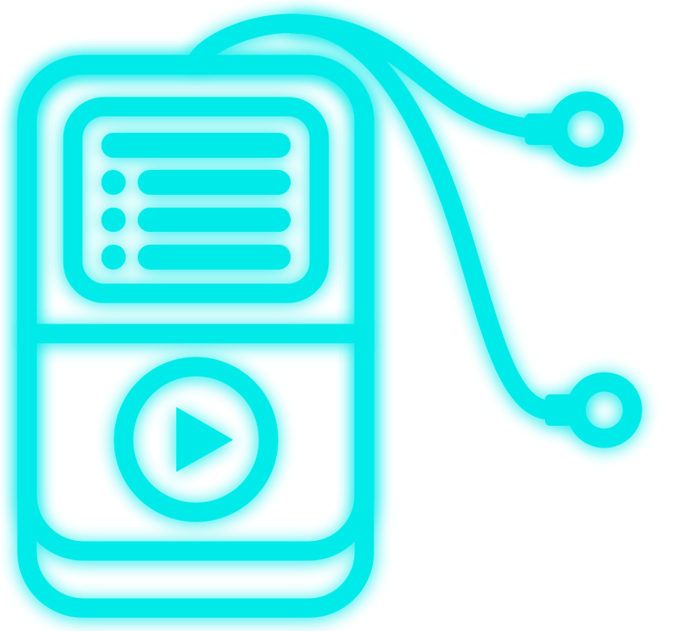
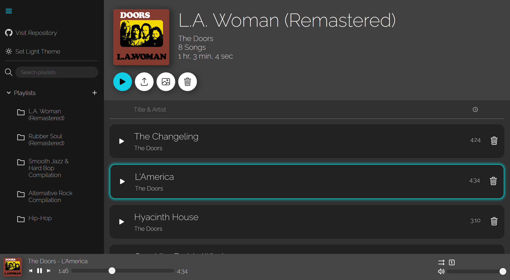

  

  A music-player web application created in React.js

------
## **About the Project** 🔎

A web application for uploading and listening to music. Similar in concept to the [vanilla JavaScript music player](https://github.com/KennethOnuorah/Javascript-Music) I made a while ago, but with additional features. Unlike the previous version that only permitted the uploading of pre-made audio directories from the user's file system, with no way of modifying them once uploaded, this app allows users to create and edit their own playlists.

In order for the app to function properly and to have a good user experience, it is highly recommended that your audio files contain metadata/id3 tag information. You can edit the metadata of your song files by right-clicking them in your file explorer and navigating to **Properties > Details** (or **Edit > Get Info** for Mac users), then edit each tag with the correct information. Or you can visit [tagmp3.net](https://tagmp3.net/).

If, however, you have [Spotify Premium](https://www.spotify.com/us/premium/), [Deezer Premium](https://www.deezer.com/us/offers/premium), [Pandora Premium](https://www.pandora.com/upgrade/premium), or any other premium subscription from a music streaming service, then you can easily download your playlists from there and upload them with the metadata already included. That way, you don't have to go through the trouble of editing each song's tag information.

Languages used: 

1. JavaScript (JSX)
2. CSS

**Project development**: 1/5/2022 - 3/29/2022

## **Requirements** 📋

This application requires the following id3 tag information:

1. Song title
2. Song artist

Acceptable audio file types:
* .mp3
* .wav
* .ogg
* .flac

## **Features** 📦️
- [x] Side menu
  * Toggling between light and dark theme
  * Ability to create, delete, rename, and rearrange playlists
  * Playlist search bar and dropdown
- [x] Playlist viewer
  * Playlist info display
  * Song uploads from filesystem (**when uploading audio, try not to upload too many files at once**.)
  * Song rearrangement and deletion
  * Custom cover art
- [x] Music controlling
  * Playing/pausing songs
  * Unlimited skipping, replaying, and playing previous songs
  * Shuffle mode
  * Album and song looping
  * Song length bar and time display
  * Volume adjustment
- [x] Storage saving

## **Screenshot** 📷

## **License** 📜
[**MIT**](https://github.com/KennethOnuorah/React-Tunes/blob/master/LICENSE)
